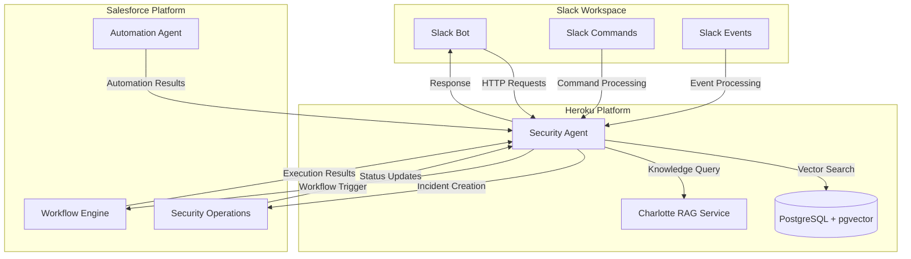

# Security Agent Integration Platform

A comprehensive security operations platform that integrates Slack, Salesforce, and Charlotte AI to provide intelligent security incident response and automation.

## System Architecture



## Components

### 1. Slack Integration
- **Slack Bot**: Handles user interactions and commands
- **Slack Commands**: Custom slash commands for security operations
- **Slack Events**: Real-time event processing for security alerts

### 2. Heroku Services
- **Security Agent**: Core application handling:
  - Command processing
  - Event handling
  - Integration orchestration
  - Response generation
- **Database**: PostgreSQL with pgvector for:
  - Security knowledge storage
  - Vector similarity search
  - Incident history
- **Charlotte RAG Service**: Mock service providing:
  - Security knowledge retrieval
  - Context-aware responses
  - Incident analysis

### 3. Salesforce Integration
- **Security Operations**: Incident management and tracking
- **Workflow Engine**: Automated response workflows
- **Automation Agent**: Task automation and execution

## Data Flow

1. **User Interaction**:
   - User sends command or alert in Slack
   - Slack Bot receives and processes the message
   - Security Agent is notified

2. **Knowledge Processing**:
   - Security Agent queries Charlotte RAG service
   - Vector search is performed on security knowledge base
   - Context-aware response is generated

3. **Incident Management**:
   - Security Agent creates incident in Salesforce
   - Workflow Engine triggers appropriate automation
   - Automation Agent executes required tasks

4. **Response Generation**:
   - Security Agent compiles response from:
     - Charlotte AI analysis
     - Salesforce incident data
     - Automation results
   - Response is sent back to Slack

## Environment Setup

### Prerequisites
- Python 3.11+
- PostgreSQL 14+
- pgvector extension
- Heroku account
- Slack workspace
- Salesforce org

### Configuration
1. **Environment Variables**:
   ```bash
   # Slack Configuration
   SLACK_BOT_TOKEN=xoxb-...
   SLACK_APP_TOKEN=xapp-...
   SLACK_SIGNING_SECRET=...

   # Anthropic Configuration
   ANTHROPIC_API_KEY=sk-ant-...

   # Database Configuration
   DATABASE_URL=postgresql://...

   # Salesforce Configuration
   SF_CLIENT_ID=...
   SF_CLIENT_SECRET=...
   SF_USERNAME=...
   SF_PASSWORD=...
   ```

2. **Database Setup**:
   ```bash
   # Enable pgvector extension
   CREATE EXTENSION vector;

   # Create security knowledge table
   CREATE TABLE security_knowledge (
       id SERIAL PRIMARY KEY,
       content TEXT NOT NULL,
       embedding vector(1536),
       created_at TIMESTAMP WITH TIME ZONE DEFAULT CURRENT_TIMESTAMP
   );
   ```

## Development Workflow

1. **Local Development**:
   ```bash
   # Create virtual environment
   python -m venv .venv
   source .venv/bin/activate

   # Install dependencies
   pip install -r requirements.txt

   # Run local server
   uvicorn mock_charlotte:app --reload
   ```

2. **Testing**:
   ```bash
   # Run database setup
   python setup_db.py

   # Test endpoint
   python test_endpoint.py
   ```

3. **Deployment**:
   ```bash
   # Push to Heroku
   git push heroku main

   # Set environment variables
   heroku config:set KEY=VALUE
   ```

## Security Considerations

1. **API Key Management**:
   - Never commit API keys to version control
   - Use environment variables for all sensitive data
   - Rotate keys regularly

2. **Data Protection**:
   - Encrypt sensitive data in transit and at rest
   - Implement proper access controls
   - Regular security audits

3. **Rate Limiting**:
   - Implement rate limiting for API endpoints
   - Monitor for suspicious activity
   - Set up alerts for unusual patterns

## Future Enhancements

1. **Advanced Features**:
   - Machine learning for incident classification
   - Automated response recommendations
   - Integration with additional security tools

2. **Scalability**:
   - Horizontal scaling for high availability
   - Caching layer for performance
   - Load balancing for heavy traffic

3. **Monitoring**:
   - Comprehensive logging
   - Performance metrics
   - Health checks

## Support

For issues and feature requests, please create a GitHub issue in this repository.

## License

This project is licensed under the MIT License - see the LICENSE file for details. 